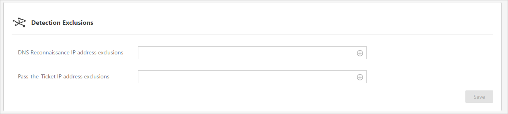

*Область применения: Advanced Threat Analytics версии 1.7*

# Работа с параметрами обнаружения ATA
На странице настройки **обнаружения** вы можете настроить список IP-адресов и подсетей, для которых возникли непредвиденные обстоятельства и которые нужно обрабатывать отдельно от остальных сущностей в сети.

## Настройка обнаружения
В разделе **Detection** (Обнаружение) вы можете задать такие элементы:

-   **Идентификатор безопасности учетных записей Honeytoken** — это учетная запись пользователя, в которой не должны выполняться сетевые операции. Эта учетная запись будет настроена как пользователь Honeytoken ATA. Если кто-то попытается использовать эту учетную запись, ATA создаст запись о подозрительных действиях, что будет означать вредоносные действия. Для настройки пользователя Honeytoken потребуется идентификатор безопасности учетной записи пользователя, а не имя пользователя.

>[!NOTE]
> Найти идентификатор безопасности пользователя вы можете на вкладке *Account Info* (Сведения об учетной записи) профиля пользователя в консоли ATA.

**Исключения обнаружения**: вы можете исключить IP-адреса из следующих случаев обнаружения. Если ввести IP-адрес в один из этих списков, ATA исключит такой IP-адрес из этого типа обнаруженных действий.

-   Исключаемые IP-адреса в случае проверки DNS

-   Исключаемые IP-адреса в случае атаки Pass-the-Ticket

## См. также
- [Обработка подозрительных действий](working-with-suspicious-activities.md)
- [Изменение конфигурации ATA](modifying-ata-configuration.md)
- [Ознакомьтесь с форумом ATA.](https://social.technet.microsoft.com/Forums/security/home?forum=mata)

<!--HONumber=Jan17_HO1-->

