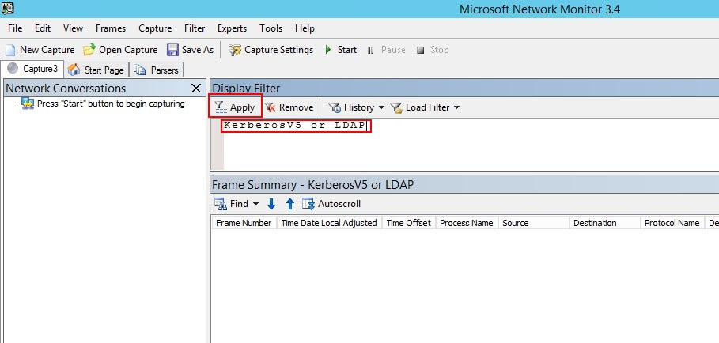

---
# required metadata

title: Проверка зеркального отображения портов | Microsoft Advanced Threat Analytics
description: Описание проверки правильной настройки зеркального отображения портов.
keywords:
author: rkarlin
manager: stevenpo
ms.date: 04/28/2016
ms.topic: get-started-article
ms.prod: identity-ata
ms.service: advanced-threat-analytics
ms.technology: security
ms.assetid: ebd41719-c91a-4fdd-bcab-2affa2a2cace

# optional metadata

#ROBOTS:
#audience:
#ms.devlang:
ms.reviewer: bennyl
ms.suite: ems
#ms.tgt_pltfrm:
#ms.custom:

---

# Проверка зеркального отображения портов
Ниже описана последовательность проверки правильной настройки зеркального отображения портов. Для правильной работы решения ATA шлюз ATA должен видеть входящий и исходящий трафик контроллера домена. Основные сведения, требуемые для работы ATA, решение получает посредством тщательного анализа пакетов входящего и исходящего сетевого трафика контроллеров домена. Чтобы решение ATA могло видеть сетевой трафик, нужно настроить зеркальное отображение портов. Эта функция копирует трафик из одного порта (исходный порт) в другой порт (конечный порт).

1.  Установите сетевой монитор [Microsoft Network Monitor 3.4](http://www.microsoft.com/download/details.aspx?id=4865) или любое другое средство сканирования сети.

    > [!IMPORTANT]
    > Не устанавливайте на шлюз ATA анализатор сообщений Microsoft Message Analyzer или другое программное обеспечение для записи сетевого трафика.

2.  Откройте сетевой монитор и создайте новую вкладку записи.

    1.  Выберите только сетевой адаптер для записи (**Capture**) или сетевой адаптер, подключенный к порту коммутатора, который настроен как конечный порт.

    2.  Активируйте неизбирательный режим.

    3.  Щелкните **New Capture** (Создать запись).

        

3.  В окне Display Filter (Фильтр отображения) укажите фильтр **KerberosV5 OR LDAP** и нажмите кнопку **Apply** (Применить).

    

4.  Щелкните **Start** (Начать), чтобы начать сеанс записи. Если входящий и исходящий трафик контроллера домена не отображается, проверьте настройки зеркального отображения портов.

    > [!NOTE]
    > Очень важно убедиться, что вы видите входящий и исходящий трафик контроллера домена.
    >
    > 

5.  Если вы видите только входящий или исходящий трафик, обратитесь за помощью к специалистам по сетям или виртуализации. Они помогут вам устранить ошибки в настройках зеркального отображения портов.

## См. также

- [Настройка зеркального отображения портов](configure-port-mirroring.md)
- [Для получения поддержки посетите наш форум.](https://social.technet.microsoft.com/Forums/security/en-US/home?forum=mata)

<!--HONumber=Apr16_HO2-->

