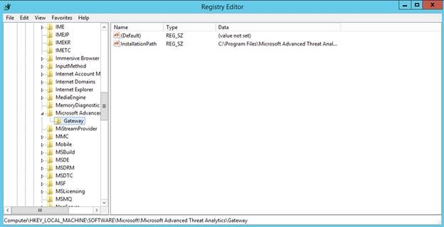

# Новые возможности ATA версии 1.4
Данные заметки о выпуске содержат сведения об известных проблемах в версии 1.4 решения Advanced Threat Analytics.

## Новые возможности этой версии

-   Поддержка функции пересылки событий Windows для отправки событий в шлюз ATA непосредственно с контроллеров домена.

-   Улучшенное обнаружение атак типа Pass-The-Hash на корпоративные ресурсы за счет объединения точек на дюйм (глубокая проверка пакетов) и журналов событий Windows.

-   Улучшенная поддержка устройств, не присоединенных к домену и не являющихся устройствами Windows, для обнаружения и видимости.

-   Повышенная производительность для увеличения поддерживаемого объема трафика на каждый шлюз ATA.

-   Повышенная производительность для поддержки большего числа шлюзов ATA на каждый центр АТА.

-   Добавлен новый автоматический процесс разрешения имен, который сопоставляет имена компьютеров с IP-адресами. Эта уникальная возможность позволит экономить ценное время в процессе исследования и обеспечит убедительные доказательства для аналитиков по вопросам безопасности.

-   Улучшенные возможности для сбора входных данных пользователей, с помощью которых можно автоматически настроить процесс обнаружения.

-   Автоматическое обнаружение устройств NAT.

-   Автоматическая отработка отказа, если контроллеры домена недоступны.

-   Уведомления и функция наблюдения за работоспособностью системы теперь предоставляют сведения об общем состоянии работоспособности развернутых приложений, а также о конкретных проблемах, связанных с настройкой и подключением.

-   Видимость для сайтов и расположений, в которых работают сущности.

-   Поддержка нескольких доменов.

-   Поддержка одноуровневых доменов (SLD).

-   Поддержка возможности изменения IP-адресов и сертификатов шлюзов ATA и центра ATA.

-   Данные телеметрии для улучшения качества.

## Известные проблемы
В этой версии существуют следующие проблемы.

### Программное обеспечение для записи сетевого трафика
Единственное программное обеспечение для записи сетевого трафика, которое поддерживается в шлюзе ATA и которое можно установить, — это [Microsoft Network Monitor 3.4](http://www.microsoft.com/download/details.aspx?id=4865). Не устанавливайте Microsoft Message Analyzer или другие программы для записи сетевого трафика. Установка другого программного обеспечения приведет к неправильной работе шлюза ATA.

### Установка из ZIP-файла
Перед установкой шлюза ATA извлеките файлы из ZIP-файла в локальный каталог и установите шлюз из него. Не устанавливайте шлюз ATA непосредственно из ZIP-файла, иначе произойдет сбой установки.

### Удаление предыдущих версий АТА
Если на вашем компьютере установлена предыдущая версия АТА, общедоступная предварительная версия или личная ознакомительная версия, следует удалить центр АТА и шлюзы АТА перед установкой данного выпуска АТА.

Необходимо удалить также файлы базы данных и файлы журнала. Базы данных из предыдущих версий ATA несовместимы с общедоступной версией ATA.

Если при попытке удалить центр ATA или шлюз ATA вместо удаления открывается окно установки ATA, необходимо добавить следующий раздел реестра и удалить ATA еще раз.

**Центр ATA**

-   HKLM\SOFTWARE\Microsoft\Microsoft Advanced Threat Analytics\Center

-   Добавьте новое строковое значение с именем `InstallationPath` и значением `C:\Program Files\Microsoft Advanced Threat Analytics\Center`. Это папка установки по умолчанию. Если вы изменили папку установки, укажите путь установки ATA.

    

**Шлюз ATA**

-   HKLM\SOFTWARE\Microsoft\Microsoft Advanced Threat Analytics\Gateway

-   Добавьте новое строковое значение с именем `InstallationPath` и значением `C:\Program Files\Microsoft Advanced Threat Analytics\Gateway`. Это папка установки по умолчанию.  Если вы изменили папку установки, укажите путь установки ATA.

    

По завершении удаления удалите папку установки в центре ATA и на шлюзе ATA.  Если база данных установлена в отдельную папку, удалите папку базы данных в центре ATA.

### Оповещение о работоспособности: шлюз ATA отключен
Если вы используете несколько шлюзов ATA и оповещения об отключении шлюзов ATA отключены, автоматическое устранение сработает только на одном из них, а остальные останутся в открытом состоянии. Необходимо вручную подтвердить, что шлюз ATA включен и запущена служба, а также вручную устранить это оповещение.

### Установка исправлений на узел виртуализации
Не устанавливайте исправление KB3047154 на узел виртуализации. Это может привести к неправильному зеркальному отображению портов.

## См. также

[Обновление до ATA 1.6. Руководство по миграции](ata-update-1.6-migration-guide.md)

[Ознакомьтесь с форумом ATA.](https://social.technet.microsoft.com/Forums/security/home?forum=mata)