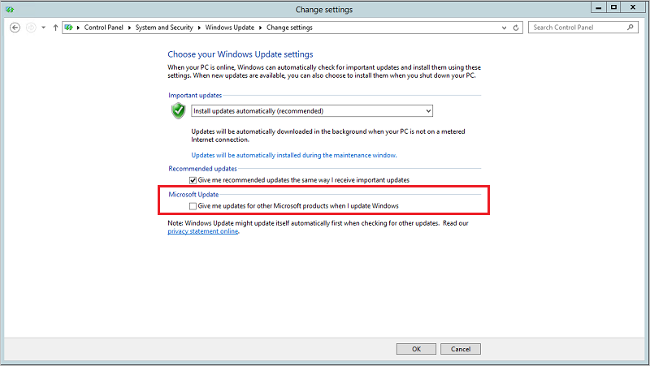

# Руководство по миграции на обновленную версию ATA 1.7
При обновлении ATA до версии 1.7 появляются следующие улучшения:

-   новые обнаружения;

-   улучшения имеющихся обнаружений.
  

## Обновление ATA до версии 1.7

> [!NOTE] 
> Если в вашей среде решение ATA не установлено, скачайте его полную версию, включая версию 1.7, и выполните стандартную процедуру установки, описанную в статье [Установка ATA. Шаг 1](install-ata-step1.md).

Если вы уже развернули версию ATA 1.6, эта процедура поможет вам выполнить действия, необходимые для обновления развертывания.

> [!NOTE] 
> ATA версии 1.7 невозможно установить поверх версий 1.4 или 1.5. Сначала следует установить ATA версии 1.6. 

Выполните следующие действия, чтобы обновить ATA до версии 1.7.

1.  [Скачайте обновление 1.7](http://www.microsoft.com/evalcenter/evaluate-microsoft-advanced-threat-analytics) 
В этой версии файл установки (Setup.exe центра Microsoft ATA) используется как для установки развертывания ATA, так и для обновления имеющихся развертываний.

2.  Обновите центр ATA.

4.  Обновите шлюзы АТА.

    > [!IMPORTANT]
    > Обновите все шлюзы ATA, чтобы решение ATA работало правильно.

### Шаг 1. Обновите центр ATA.

1.  Создайте резервную копию базы данных (необязательно).

    -   Если центр АТА работает как виртуальная машина и вы хотите создать контрольную точку, сначала отключите виртуальную машину.

    -   Если центр ATA работает на физическом сервере, следуйте рекомендованной процедуре, чтобы выполнить [резервное копирование MongoDB](https://docs.mongodb.org/manual/core/backups/).

2.  Запустите файл **Setup.exe центра Microsoft ATA** и следуйте указаниям на экране, чтобы установить обновление.

    -  На странице **приветствия** выберите язык и нажмите кнопку **Далее**.

    -  Если вы не включали автоматическое обновление в версии 1.6, вам будет предложено настроить для ATA использование Центра обновления Майкрософт для поддержания актуального состояния ATA.  На странице Центра обновления Майкрософт установите флажок **Использовать Центр обновления Майкрософт при проверке наличия обновлений (рекомендуется)**.
     Таким образом параметры Windows будут настроены для обновления других продуктов корпорации Майкрософт, включая ATA, как показано ниже. 
     

    -  На экране **Перенос данных** укажите, хотите ли вы перенести все данные или некоторую их часть. Если выполнять частичный перенос данных, собранные ранее профили сетевого трафика и поведения перенесены не будут. В этом случае системе обнаружения аномального поведения потребуется три недели, прежде чем она соберет полный профиль, позволяющий выявлять аномальное поведение. В течение этого времени все остальные функции обнаружения ATA будут работать правильно. При **частичном** переносе данных процесс установки занимает гораздо меньше времени. Если вы выберете **полный** перенос данных, установка может длиться намного дольше. Прогнозы времени установки и требуемого места на диске, которые указаны на экране **переноса данных**, зависят от объема ранее собранного сетевого трафика, который хранился в предыдущих версиях ATA. Прежде чем выбрать **частичный** или **полный** перенос данных, оцените эти прогнозы.  
    
    

    -  Нажмите кнопку **Обновить**. После нажатия кнопки "Обновить" ATA переходит в автономный режим до завершения обновления.

4.  После успешного обновления центра ATA щелкните **Запустить**, чтобы открыть в консоли ATA экран **обновления** для шлюзов ATA.
    

5.  Если вы уже настроили автоматическое обновление для шлюзов ATA, на экране **обновлений** вы увидите, что они уже обновляются. Если шлюзы не обновляются, щелкните кнопку **Обновить** рядом с каждым из шлюзов ATA.
  

  
> [!IMPORTANT] 
> Обновите все шлюзы ATA, чтобы решение ATA работало правильно.
> Настроенный порт прослушивателя Syslog для всех шлюзов будет изменен на 514.
 
> [!NOTE] 
> Чтобы установить новые шлюзы ATA, перейдите к экрану **Шлюзы** и выберите команду **Скачать установщик шлюза**, чтобы получить установочный пакет ATA 1.7, а затем следуйте инструкциям по установке нового шлюза в разделе [Шаг 4. Установка шлюза ATA](install-ata-step4.md).

## См. также

- [Ознакомьтесь с форумом ATA.](https://social.technet.microsoft.com/Forums/security/home?forum=mata)
