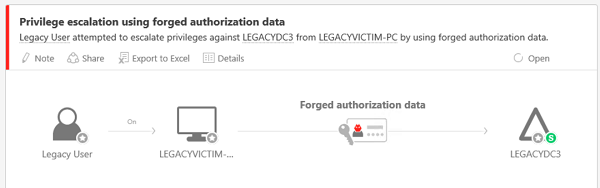

*Применяется к Advanced Threat Analytics версии 1.8*

# Анализ атак, направленных на повышение привилегий с использованием поддельных данных авторизации

Корпорация Майкрософт постоянно совершенствует возможности обнаружения угроз безопасности и предоставления специалистам в области аналитики безопасности информации, на основании которой можно принимать конкретные меры. Реализовать это изменение поможет служба Advanced Threat Analytics (ATA). Если служба ATA обнаруживает подозрительное действие, напоминающее повышение привилегий с использованием поддельных данных авторизации, и выводит соответствующее оповещение, сведения в этой статье будут полезны для его изучения.

## Что такое сертификат атрибута привилегий (PAC)?

Сертификат атрибута привилегий (PAC) — это структура данных в билете Kerberos, которая содержит информацию об авторизации, включая членство в группах, идентификаторы безопасности и сведения о профиле пользователя. Благодаря этому в домене Active Directory можно передавать данные авторизации, предоставляемые контроллером домена (DC), на другие рядовые серверы и рабочие станции в целях проверки подлинности и авторизации. Помимо сведений о членстве, PAC содержит дополнительные сведения об учетных данных, профиле и политике, а также метаданные безопасности. 

Протоколы проверки подлинности (протоколы, проверяющие удостоверения) используют структуру данных PAC для передачи информации об авторизации, которая управляет доступом к ресурсам.

### Проверка PAC

Проверка PAC — это функция безопасности для предотвращения несанкционированного доступа к системе или ее ресурсам в ходе атаки "злоумышленник в середине", особенно в приложениях, где используется олицетворение пользователя. В олицетворении участвует удостоверение, например учетная запись службы, которой предоставлены повышенные права для доступа к ресурсам и выполнения задач. Проверка PAC обеспечивает более безопасную среду авторизации в параметрах подлинности Kerberos, где происходит олицетворение. [Проверка PAC](https://blogs.msdn.microsoft.com/openspecification/2009/04/24/understanding-microsoft-kerberos-pac-validation/) гарантирует, что данные авторизации пользователя точно соответствуют данным, предоставленным в билете Kerberos, и что привилегии билета не были изменены.

При выполнении проверки PAC сервер кодирует сообщение запроса, содержащее тип и длину подписи PAC, и передает его на контроллер домена. Контроллер домена расшифровывает запрос и извлекает контрольную сумму сервера и значения контрольной суммы KDC. В случае успешной проверки контрольной суммы контроллер домена возвращает код успеха на сервер. Неудачный код возврата означает, что PAC был изменен. 

Содержимое Kerberos PAC подписывается дважды: 
- один раз с использованием главного ключа KDC — для предотвращения изменения данных авторизации вредоносными серверными службами;
- один раз с использованием главного ключа учетной записи конечного сервера ресурсов — для предотвращения изменения содержимого PAC и добавления собственных данных авторизации пользователями.

### Уязвимость PAC
В бюллетенях по безопасности [MS14-068](https://technet.microsoft.com/library/security/MS14-068.aspx) и [MS11-013](https://technet.microsoft.com/library/security/ms11-013.aspx) устранены уязвимости в центре распространения ключей Kerberos. Эти уязвимости дают злоумышленникам возможность управления полем PAC в действительном билете Kerberos с предоставлением им дополнительных привилегий.

## Атака, направленная на повышение привилегий с использованием поддельных данных авторизации

Атака, направленная на повышение привилегий с использованием поддельных данных авторизации, — это предпринимаемая злоумышленником попытка использования уязвимостей PAC с целью повышения прав доступа в лесу или домене Active Directory. Для проведения этой атаки злоумышленник должен:
-   иметь учетные данные пользователя домена;
-   иметь сетевое подключение к контроллеру домена, который можно использовать для проверки подлинности скомпрометированных учетных данных домена;
-   иметь нужные средства. Python Kerberos Exploitation Kit (PyKEK) — это известное средство для подделки сертификатов PAC.

Если у злоумышленника есть необходимые учетные данные и возможность подключения, он может изменить или подделать сертификат атрибута привилегий (PAC) для существующего токена входа пользователя Kerberos (TGT). Злоумышленник изменяет заявку членства в группе для включения группы с более высокими привилегиями (например, "Администраторы домена" или "Администраторы предприятия"). Затем он включает измененный PAC в билет Kerberos. Этот билет Kerberos используется для запроса билета службы от контроллера домена (DC) без установленных исправлений, в результате чего злоумышленник получает повышенные права для доступа к домену и для выполнения действий, которые он не должен делать. Злоумышленник может представлять измененный маркер входа пользователя (TGT) для получения доступа к любому ресурсу в домене, запрашивая маркеры доступа к ресурсам (TGS). Это означает, что злоумышленник может обойти все настроенные списки управления доступом к ресурсам, которые ограничивают доступ к сети, подменив данные авторизации (PAC) любого пользователя в Active Directory.

## Обнаружение атаки
Когда злоумышленник пытается повысить свои привилегии, служба ATA обнаруживает это действие и помечает его как оповещение с высоким уровнем серьезности.

ATA укажет в оповещении о подозрительном действии состояние повышения привилегий с использованием поддельных данных авторизации — успешное или неудачное. Следует анализировать оповещения и об успехах, и о неудачах, так как неудачные попытки все же могут означать присутствие злоумышленника в вашей среде.

## Анализ
После получение оповещения о повышении привилегий с использованием поддельных данных авторизации в ATA необходимо определить, что нужно сделать для устранения атаки. Для этого сначала следует классифицировать оповещение как одно из следующих: 
-   Истинное положительное: служба ATA обнаружила вредоносное действие.
-   Ложное срабатывание. Ложное оповещение: на самом деле повышения привилегий с использованием поддельных данных авторизации не было (это событие, которое служба ATA ошибочно приняла за атаку, направленную на повышение привилегий с использованием поддельных данных авторизации).
-   Неопасное истинное положительное: действие, обнаруженное службой ATA, является реальным, но не вредоносным (например, тест на проникновение).

На следующей схеме приведены шаги, которые следует выполнить.

1. Сначала просмотрите оповещение на временной шкале атаки ATA, чтобы узнать состояние попытки авторизации с подложными данными — "Успешно", Сбой", "Попытка" (попытки атаки также считаются неудачными атаками). Успешные и неудачные попытки могут привести к истинному положительному результату, но с разными уровнями серьезности в среде.
 
 

2.  Если обнаруженная атака, направленная на повышение привилегий с использованием поддельных данных авторизации, была успешной.
    -   Если на контроллере домена, где было выдано оповещение, установлены правильные исправления, этот результат является ложным положительным. В этом случае необходимо отклонить оповещение и отправить группе ATA сообщение по адресу ATAEval@microsoft.com. Тогда ATA сможет постоянно совершенствовать процесс обнаружения. 
    -   Если на контроллере домена, где было выдано оповещение, не установлены нужные исправления.
        -   Если служба, указанная в оповещении, не имеет собственного механизма авторизации, этот результат является истинным положительным, поэтому в организации следует запустить процесс реагирования на инциденты (IR). 
        -   Если служба, указанная в оповещении, имеет внутренний механизм авторизации, который запрашивает данные авторизации, действие может быть ошибочно определено как атака, направленная на повышение привилегий с использованием поддельных данных авторизации. 

3.  Если обнаруженная атака завершилась сбоем.
    -   Если известно, что операционная система или приложение приводит к изменению PAC, то, скорее всего, возможен неопасный истинный положительный результат. Для исправления этого поведения потребуется обратиться к владельцу приложения или операционной системы.

    -   Если операционная система или приложение не изменяют PAC. 

        -   Если служба, указанная в оповещении, не имеет собственного механизма авторизации, этот результат является истинным положительным, поэтому в организации следует запустить процесс реагирования на инциденты (IR). Даже если злоумышленнику не удалось повысить уровень своих привилегий в домене, можно предположить, что в сети присутствует злоумышленник, и его нужно найти как можно быстрее, прежде чем он попытается запустить другие направленные атаки для повышения прав доступа. 
        -   Если служба, указанная в оповещении, имеет собственный механизм авторизации, который запрашивает данные авторизации, действие может быть ошибочно определено как атака, направленная на повышение привилегий с использованием поддельных данных авторизации.

## Действия после анализа
Если вам требуется определить, развернул ли злоумышленник средства, позволяющие ему задержаться в сети вашей организации, корпорация Майкрософт рекомендует обратиться к специалистам группы реагирования на инциденты, с которыми можно связаться через отдел по работе с клиентами Майкрософт.

## Меры по снижению уязвимости

Примените обновления из бюллетеней по безопасности [MS14-068](https://technet.microsoft.com/library/security/MS14-068.aspx) и [MS11-013](https://technet.microsoft.com/library/security/ms11-013.aspx), которые устраняют уязвимости в центре распространения ключей Kerberos. 

## См. также
- [Обработка подозрительных действий](working-with-suspicious-activities.md)
- [Ознакомьтесь с форумом ATA.](https://social.technet.microsoft.com/Forums/security/home?forum=mata)
