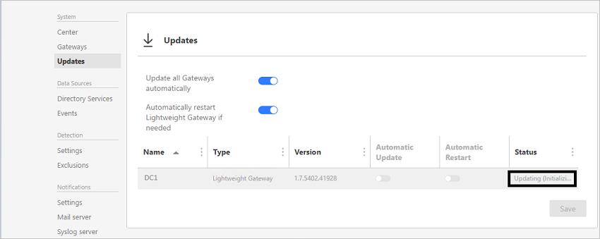

# Новые возможности ATA версии 1.7
В этих заметках о выпуске содержатся сведения об известных проблемах в текущей версии Advanced Threat Analytics.

## Что нового в обновлении ATA 1.7
При обновлении ATA до версии 1.7 появляются следующие улучшения:

-   новые и обновленные обнаружения;

-   контроль доступа на основе ролей;

-   Поддержка Windows Server 2016 и Windows Server 2016 Базовая

-   улучшенное взаимодействие с пользователем;

-   несущественные изменения.

### новые и обновленные обнаружения;

- **Разведывательная атака с помощью перечисления служб каталогов:** на этапе разведывательной атаки злоумышленники различными методами собирают сведения о сущностях в сети. Перечисление служб каталога с помощью протокола SAM-R позволяет злоумышленникам получить список пользователей и групп в домене, а также понять взаимосвязь между разными сущностями. 

- **Усовершенствования для pass-the-hash:** мы добавили несколько дополнительных поведенческих моделей для проверки подлинности сущностей, что позволяет улучшить обнаружение атак pass-the-hash. Эти модели позволяют ATA сопоставлять поведение сущностей с подозрительной проверкой подлинности NTLM, а также отличать реальные атаки pass-the-hash от безопасных сценариев, имеющих схожие симптомы.

- **Усовершенствования для pass-the-ticket:** чтобы успешно обнаруживать современные атаки, в частности pass-the-ticket, важно точно отслеживать сопоставление IP-адресов и учетных записей компьютера. Это нелегко в таких средах, где конструктивно предусмотрены быстрые смены IP-адресов (например, сети на основе Wi-Fi или несколько виртуальных машин на одном узле). Чтобы преодолеть эту проблему и повысить точность выявления атак pass-the-ticket, мы значительно улучшили механизм, используемый ATA для разрешения сетевых имен, что позволяет снизить количество ложных срабатываний.

- **Усовершенствования для аномального поведения:** в ATA 1.7 добавлены данные проверки подлинности NTLM в качестве нового источника данных для обнаружения аномального поведения, что позволяет использовать алгоритмы с более широким покрытием поведения сущностей в сети. 

- **Усовершенствования для необычных реализаций протоколов:** теперь ATA обнаруживает необычные реализации протокола Kerberos, а также некоторые новые сценарии для протокола NTLM. В частности, такие аномалии Kerberos часто характерны для атак Over-pass-the-Hash.

### Инфраструктура

- **Управление доступом на основе ролей:** возможность управления доступом на основе ролей (RBAC). В ATA версии 1.7 поддерживаются три роли: администратор ATA, аналитик ATA и руководитель ATA.

- **Поддержка Windows Server 2016 и Windows Server Базовая**: ATA 1.7 поддерживает развертывание облегченных шлюзов на контроллерах домена под управлением Windows Server 2008 R2 с пакетом обновления 1 (SP1) (за исключением основных серверных компонентов), Windows Server 2012, Windows Server 2012 R2, Windows Server 2016 (включая основные компоненты, но не Nano). Кроме того, в этом выпуске Windows Server 2016 поддерживается обоими компонентами: центром ATA и шлюзом ATA.

### Действия пользователя
- **Возможности настройки:** в этом выпуске переработан интерфейс настройки ATA, чтобы предоставить больше удобств для пользователя и улучшить поддержку сред с несколькими шлюзами ATA. Также в этой версии появилась страница обновления шлюза ATA, которая позволяет проще и точнее управлять автоматическим обновлением для различных шлюзов.

## Известные проблемы
В этой версии существуют следующие проблемы.

### Автоматическое обновление шлюза может завершиться ошибкой
**Признаки**. В окружениях с медленными каналами связи с глобальной сетью может быть превышено время ожидания для обновления шлюза ATA (100 секунд), в результате чего обновление не будет выполнено.
В консоли ATA для такого шлюза ATA состояние "Обновление (Загрузка пакета)" будет сохраняться в течение долгого времени, а затем процесс завершается ошибкой.
**Обходной путь**. Чтобы решить эту проблему, скачайте последнюю версию пакета для шлюза ATA через консоль ATA и обновите шлюз ATA вручную.

> [!IMPORTANT]
>  Не поддерживается автоматическое продление для тех сертификатов, которые используются в ATA. Если используются такие сертификаты, ATA может перестать работать после автоматического обновления сертификата. 

### Отсутствие поддержки кодировки JIS в браузере
**Признаки**. Консоль ATA может работать в браузерах неправильно, если используется кодирование JIS. **Решение**. Измените в браузере кодировку на Юникод (UTF-8).
 
### Пропущенный трафик зеркального отражения портов при использовании VMware

Оповещения о пропущенном трафике зеркального отражения портов при использовании упрощенного шлюза в VMware

Если используются контроллеры доменов на виртуальных машинах VMware, вам могут приходить оповещения о **пропущенном трафике зеркального отражения портов**. Это происходит из-за несоответствия конфигурации в VMware. Чтобы эти оповещения не появлялись, присвойте следующим параметрам виртуальной машины значение "0" или "Отключено":  

- TsoEnable
- LargeSendOffload(IPv4)
- IPv4 TSO Offload

Кроме того, рекомендуется отключить IPv4 Giant TSO Offload. Для получения дополнительной информации обратитесь к документации VMware.

### Сбой автоматического обновления шлюза при обновлении до версии 1.7 с обновлением 1

При обновлении ATA 1.7 до ATA 1.7 с обновлением 1 процесс автоматического обновления шлюза ATA и установка шлюза вручную при помощи пакета шлюза могут не работать должным образом.
Эта проблема возникает, если использованный Центром ATA сертификат был изменен перед обновлением ATA.
Чтобы проверить эту проблему, просмотрите журнал **Microsoft.Tri.Gateway.Updater.log** сетевого шлюза ATA и найдите следующие исключения: **System.Net.Http.HttpRequestException: An error occurred while sending the request. ---> System.Net.WebException: The underlying connection was closed: An unexpected error occurred on a send. ---> System.IdentityModel.Tokens.SecurityTokenValidationException: Failed to validate certificate thumbprint**.

Чтобы устранить эту проблему, после изменения сертификата из командной строки с повышенными привилегиями перейдите в папку **%ProgramFiles%\Microsoft Advanced Threat Analytics\Center\MongoDB\bin** и выполните следующую команду:

1. Mongo.exe ATA ("ATA" следует написать прописными буквами) 

2. CenterThumbprint=db.SystemProfile.find({_t:"CenterSystemProfile"}).toArray()[0].Configuration.SecretManagerConfiguration.CertificateThumbprint;

3. db.SystemProfile.update({_t:"ServiceSystemProfile"},{$set:{"Configuration.ManagementClientConfiguration.ServerCertificateThumbprint":CenterThumbprint}}, {multi: true})

### Экспорт сведений о подозрительной активности в Excel может завершиться ошибкой.
При попытке экспортировать сведения о подозрительной активности в файл Excel, операция может не выполнится со следующей ошибкой: *Error [BsonClassMapSerializer`1] System.FormatException: An error occurred while deserializing the Activity property of class Microsoft.Tri.Common.Data.NetworkActivities.SuspiciousActivityActivity: Element 'ResourceIdentifier' does not match any field or property of class Microsoft.Tri.Common.Data.EventActivities.NtlmEvent. ---> System.FormatException: Element 'ResourceIdentifier' does not match any field or property of class Microsoft.Tri.Common.Data.EventActivities.NtlmEvent.*

Чтобы устранить эту проблему, в командной строке с повышенными привилегиями перейдите в папку **%ProgramFiles%\Microsoft Advanced Threat Analytics\Center\MongoDB\bin** и выполните следующую команду:
1.  `Mongo.exe ATA` (ATA следует указать прописными буквами).
2.  `db.SuspiciousActivityActivity.update({ "Activity._t": "NtlmEvent" },{$unset: {"Activity.ResourceIdentifier": ""}}, {multi: true});`

## несущественные изменения.

- Для консоли ATA вместо IIS теперь используется OWIN.
- Если служба центра ATA не работает, вы не сможете получить доступ к консоли ATA.
- Из-за изменений в механизме разрешения сетевых имен ATA подсети с краткосрочной арендой больше не требуются.

## См. также
[Ознакомьтесь с форумом ATA.](https://social.technet.microsoft.com/Forums/security/home?forum=mata)

[Обновление до ATA 1.7. Руководство по миграции](ata-update-1.7-migration-guide.md)

