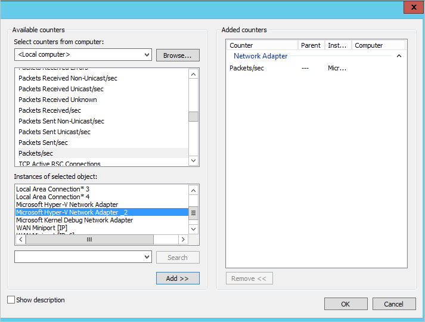
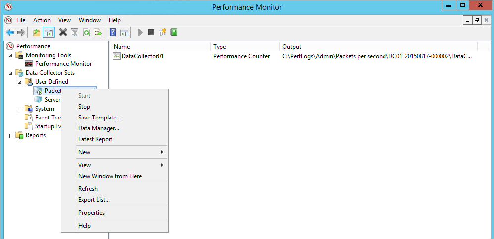

*Применяется к: Azure Advanced Threat Protection*

# Планирование производительности Azure ATP
В этой статье содержатся сведения, которые помогут определить количество необходимых датчиков и автономных датчиков Azure ATP.

> [!NOTE] 
> Средство изменения размера состоит из двух листов — по одному для ATA и Azure ATP. Убедитесь, что вы используете нужный лист.

## Использование средства изменения размера
Рекомендуемый и самый простой способ определить емкость развертывания Azure ATP — это использовать [средство изменения размера Azure ATP](http://aka.ms/aatpsizingtool). Запустите средство изменения размера Azure ATP и в файле Excel с результатами определите объем памяти и ресурсов ЦП, используемый датчиком.

- Датчик Azure ATP: сопоставьте значение в поле **Занятых пакетов/с** в таблице датчика Azure ATP в файле результатов со значением в поле **Пакетов в секунду** в [таблице автономного датчика Azure ATP](#azure-atp-sensor-sizing) или [таблице датчика Azure ATP](#azure-atp-standalone-sensor-sizing) в зависимости от [выбранного типа датчика](#choosing-the-right-sensor-type-for-your-deployment).

Если по каким-либо причинам вы не можете использовать средство изменения размера Azure ATP, необходимо вручную собрать данные по числу пакетов в секунду с коротким интервалом сбора (примерно 5 секунд) со всех контроллеров домена за 24 часа. Затем для каждого контроллера домена необходимо вычислить ежедневное среднее значение и среднее значение самого занятого периода (15 минут).
В следующих разделах представлены инструкции по сбору числа пакетов в секунду с одного контроллера домена.

## Выбор правильного типа датчика для развертывания
В развертывании Azure ATP поддерживается любое сочетание типов автономных датчиков Azure:

- Только автономные датчики Azure ATP
- Только датчик Azure ATP
- Комбинация шлюзов

При выборе типа развертывания датчика необходимо учитывать указанные ниже преимущества.

|Тип датчика|Преимущества|Стоимость|Топология развертывания|Использование контроллера домена|
|----|----|----|----|-----|
|Автономный датчик Azure ATP|Внешнее развертывание усложняет обнаружение Azure ATP для злоумышленников|Выше|Устанавливается вместе с контроллером домена (внешняя установка)|Поддерживает до 100 000 пакетов в секунду|
|Датчик Azure ATP|Не требует выделенного сервера и настройки зеркального отражения портов|Нижний|Устанавливается на контроллере домена|Поддерживает до 100 000 пакетов в секунду|

При определении числа автономных датчиков Azure ATP, которые необходимо развернуть, учитывайте указанные ниже моменты.

-   **Леса и домены Active Directory** 
    Azure ATP может отслеживать трафик из нескольких доменов в нескольких лесах Active Directory для каждой создаваемой рабочей области. 

-   **Зеркальное отображение портов** 
Согласно рекомендациям по зеркальному отображению портов, возможно, потребуется развернуть несколько автономных датчиков Azure ATP в центре данных или на сайте филиала.

-   **Емкость** 
    Автономный датчик Azure ATP поддерживает отслеживание нескольких контроллеров домена в зависимости от объема сетевого трафика отслеживаемых контроллеров домена. 

## Изменение размера датчика и автономного датчика Azure ATP 

Датчик Azure ATP поддерживает отслеживание одного контроллера домена в зависимости от объема сетевого трафика, создаваемого контроллером домена. В следующей таблице приводятся приблизительные данные, так как окончательный объем, анализируемый датчиком, зависит от объема и распределения трафика. 
> [!NOTE]
> Следующие значения емкости для ЦП и памяти относятся к потреблению самого датчика, а не к емкости контроллеров доменов.

|Пакетов в секунду*|ЦП (ядра)|Память (ГБ)|
|----|----|-----|
|0–1 тыс.|0,25|2,50|
|1–5 тыс.|0,75|6,00|
|5–10 тыс.|1,00|6,50|
|10–20 тыс.|2,00|9,00|
|20–50 тыс.|3,50|9,50|
|50–75 тыс. |3,50|9,50|
|75–100 тыс.|3,50 |9,50|

> [!NOTE]
> - Общее количество ядер, которые будет использовать служба датчика. Работать с ядрами, поддерживающими технологию Hyper-Threading, не рекомендуется.
> - Общий объем памяти, который будет использовать служба датчика.
> -   Если на контроллере домена нет ресурсов, необходимых датчику Azure ATP, это не повлияет на производительность контроллера, но датчик Azure ATP, возможно, не будет работать должным образом.
> -   При запуске в качестве динамической памяти виртуальной машины или любой другой памяти функция воздушного шага не поддерживается.
> -   Для обеспечения оптимальной производительности задайте для **параметра электропитания** датчика Azure ATP значение **высокой производительности**.
> -   Требуется не менее двух ядер и 6 ГБ пространства. Мы рекомендуем 10 ГБ. Сюда входит пространство, необходимое для двоичных файлов и журналов Azure ATP.

## Оценка трафика контроллера домена

Существуют различные инструменты, с помощью которых можно определить среднее число пакетов в секунду, отправляемых с контроллеров домена. Если у вас нет таких инструментов, эти сведения можно отследить с помощью системного монитора.

Чтобы определить число пакетов в секунду, выполните на каждом контроллере домена указанные ниже действия.

1.  Откройте системный монитор.

    

2.  Разверните узел **Группы сборщиков данных**.

    

3.  Щелкните правой кнопкой мыши узел **Определяется пользователем** и последовательно выберите **Создать** &gt; **Группа сборщиков данных**.

    

4.  Введите имя группы сборщиков данных и установите переключатель **Создать вручную (для опытных)**.

5.  В разделе **Какой тип данных вы хотите использовать?** выберите **Создать журналы данных и Счетчик производительности**.

    

6.  В разделе **Какие счетчики производительности следует записывать в журнал?** нажмите кнопку **Добавить**.

7.  Разверните узел **Сетевой адаптер**, выберите пункт **Пакетов/с** и выберите подходящий экземпляр. Если вы не уверены, выберите значение **&lt;Все экземпляры&gt;** и нажмите кнопку **Добавить**, а затем — **ОК**.

    > [!NOTE]
    > Чтобы увидеть имя адаптера и сведения о конфигурации, выполните в командной строке команду `ipconfig /all`.

    

8.  Установите для параметра **Интервал выборки** значение **5 секунд**.

9. Задайте папку для хранения данных.

10. В разделе **Create the data collector set** (Создать группу сборщиков данных) выберите **Запустить группу сборщиков данных сейчас** и нажмите кнопку **Готово**.

    После этого отобразится созданная группа сборщиков данных с зеленым треугольником, который указывает на то, что она активна.

11. Через 24 часа остановите группу сборщиков данных, щелкнув ее правой кнопкой мыши и выбрав пункт **Остановить**.

    

12. В проводнике перейдите к папке, в которой сохранен BLG-файл, и дважды щелкните его, чтобы открыть в системном мониторе.

13. Выберите счетчик пакетов в секунду и запишите приведенные в нем среднее и максимальные значения.

    

## См. также
- [Средство изменения размера Azure ATP](http://aka.ms/aatpsizingtool)
- [Предварительные требования к Azure ATP](atp-prerequisites.md)
- [Архитектура Azure ATP](atp-architecture.md)
- [Обязательно ознакомьтесь с форумом ATP](https://aka.ms/azureatpcommunity)
